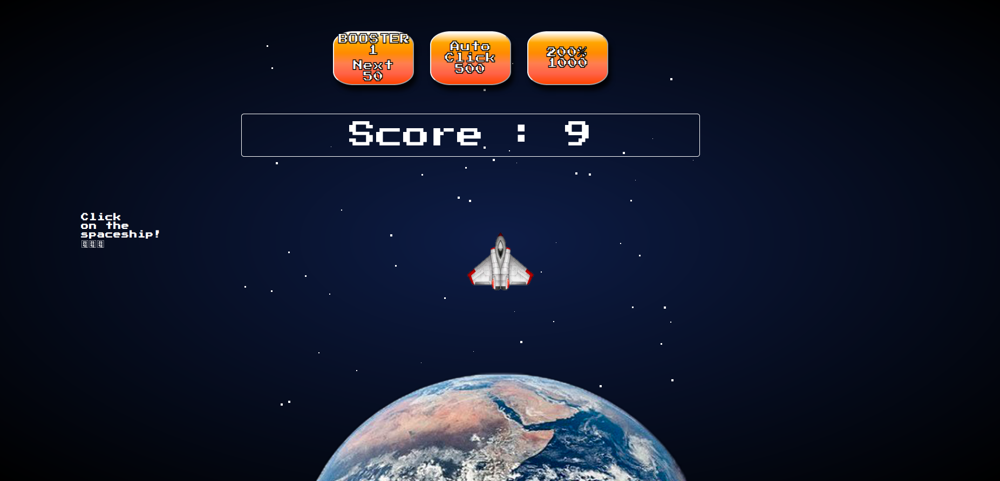

# CookieClicker

Réaliser le principe du jeu CookieClicker.

## Pincipe du jeu :

Fais décoller la fusée

Plus tu cliques, plus tu gagnes !!!

## Collaborateurs :

+ Weiss Dorothée
+ Guy DJendo
+ Mona Marchetti
+ Jean Philippe Scheppers

## Date :

Effectué la semaine du 7 au 14 février 2019 en tant que stagiaires chez BeCode

## Langages utilisés :

+ HTML
+ CSS
+ JAVASCRIPT
+ CANVAS

## Progression :

Terminé

## Liens utiles :

lien des consignes : <https://github.com/becodeorg/BXL-Johnson-3.9/tree/master/Projets/coockie-clicker>

lien github page : <https://jpscheppers.github.io/CookieClicker/>

## Aperçu du jeu :

